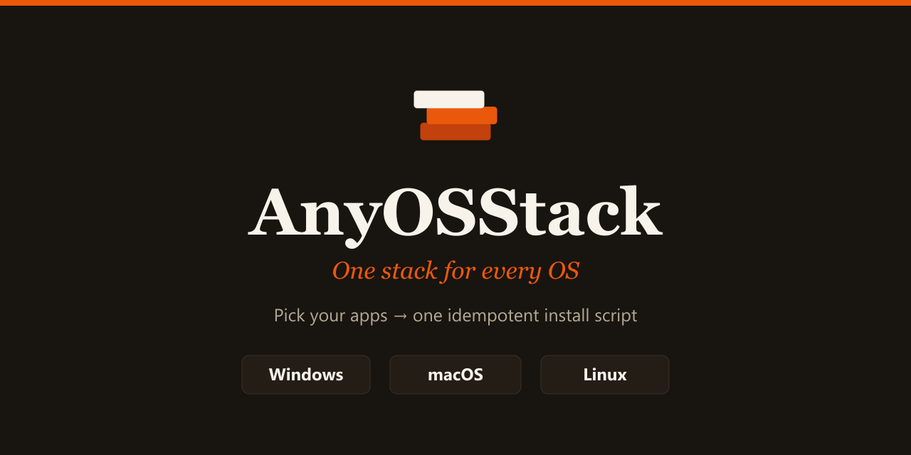
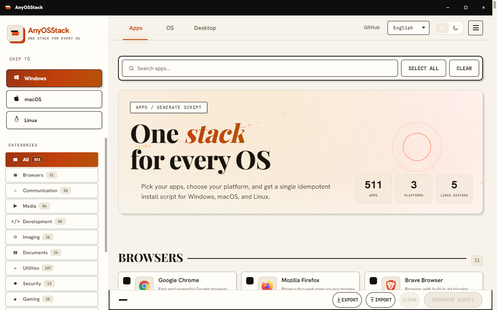
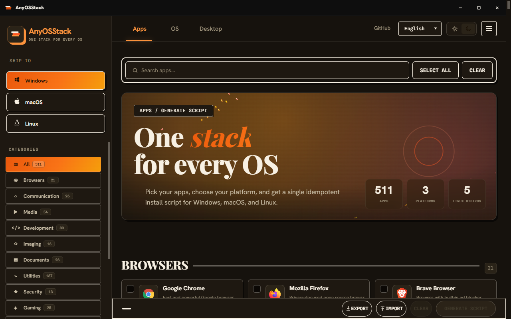

<div align="center">



<p><strong>Pick your apps once, get a single idempotent install script for Windows, macOS, and Linux — or run it right inside the app.</strong></p>

[](https://github.com/tweedlex754/AnyOSStack/actions/workflows/build.yml)
[](https://github.com/tweedlex754/AnyOSStack/actions/workflows/release.yml)
[](LICENSE)
[](#install)

</div>

---

## What it is

AnyOSStack is a Ninite/WinUtil-style app picker. Tick the applications you want
from a curated catalog of **500+ programs**, choose your platform, and it
generates one clean, **idempotent** install script that uses the platform's own
package manager — `winget` on Windows, Homebrew on macOS,
`apt`/`dnf`/`pacman`/`flatpak` on Linux, with an `npm -g` fallback where
applicable. Re-running a generated script is always safe: already-installed apps
are detected and skipped.

It runs as a **real native desktop app** (not a browser tab): a frameless window
with its own branded title bar and window controls — native traffic lights on
macOS — that opens straight into the picker.

## Screenshots

| Light theme | Dark theme |
| --- | --- |
|  |  |

## Features

| | |
| --- | --- |
| 🗂️ **500+ curated apps** | Organized into 14 categories, each with its own icon. |
| 📝 **Idempotent scripts** | Safe to re-run — installed apps are detected and skipped. |
| ▶️ **Run Now** | Execute the generated script in-app with live streamed output and contextual admin/root elevation — or just copy/download it. |
| 💾 **Presets** | Export your selection as a shareable `.json` and import it on another machine. |
| 🌍 **12 languages** | Full UI localization, including RTL, plus a localized installer. |
| 🌓 **Light & dark** | Themed to match your OS, with an in-app toggle. |
| 📴 **Fully offline** | Fonts are bundled; nothing is fetched at runtime. |
| 🖥️ **Native everywhere** | Windows (installer + portable), macOS (DMG), Linux (AppImage/deb/rpm). |

## Why AnyOSStack?

Setting up a fresh machine means hunting down a dozen installers, clicking
through a dozen wizards, and repeating it on every OS you touch. Tools like
Ninite solved this for Windows; AnyOSStack takes the same idea **cross-platform**
and **transparent**: instead of a black-box bundle, it hands you a readable
script that uses your OS's own package manager, that you can inspect before it
runs, re-run safely, and share with your team as a preset.

## Install

### One line

Paste this into a terminal and the package for your platform lands on your
Desktop. No admin rights are needed to download — Windows asks for elevation
when you *run* the installer, not here.

**Windows — PowerShell**

```powershell
irm https://raw.githubusercontent.com/tweedlex754/AnyOSStack/main/scripts/bootstrap/get.ps1 | iex
```

**macOS / Linux — terminal**

```bash
curl -fsSL https://raw.githubusercontent.com/tweedlex754/AnyOSStack/main/scripts/bootstrap/get.sh | sh
```

Both take the Release asset when there is one and fall back to the chunked copy
in `installer-parts/` when there is not. Every download is checked against the
SHA-256 in `installer-parts/manifest.json`, and the rejoined file is checked
again as a whole, so a truncated part can never become a silently corrupt
installer. Re-running is safe: a verified copy already on your Desktop is left
alone.

On macOS and Linux the shell script fetches that platform's own package
(`.dmg` / `.AppImage`). Set `ANYOSSTACK_ARTIFACT=windows` to rebuild the Windows
installer instead — handy when preparing a Windows machine from a Mac.

### Manual download

Grab the latest build for your OS from the
[**Releases**](https://github.com/tweedlex754/AnyOSStack/releases) page.

| OS | Download | Notes |
| --- | --- | --- |
| **Windows 10/11** | `AnyOSStack-Setup-x.y.z.exe` (installer) or `-portable.exe` | Needs [App Installer / winget](https://learn.microsoft.com/windows/package-manager/winget/). |
| **macOS** | `AnyOSStack-x.y.z.dmg` | Drag to Applications. |
| **Linux** | `.AppImage` (universal), `.deb`, or `.rpm` | AppImage may need `libfuse2` on some distros. |

### First-launch security prompts (unsigned builds)

These builds are **not code-signed** (signing certificates cost money; this is a
free, open project). Your OS will warn you the first time — this is expected:

- **Windows** — SmartScreen shows "Windows protected your PC." Click
  **More info → Run anyway**.
- **macOS** — Gatekeeper says the developer "cannot be verified." Right-click the
  app → **Open**, or run `xattr -cr /Applications/AnyOSStack.app` once.
- **Linux** — mark the AppImage executable: `chmod +x AnyOSStack-*.AppImage`.

You can always verify what you're running: the full source is here, and every
release is built in public CI (see [`.github/workflows/release.yml`](.github/workflows/release.yml)).

## Usage

1. **Pick apps** — search/filter the catalog and tick what you want.
2. **Choose your target** — Windows, macOS, or a Linux distro family.
3. **Generate** — review the script in the preview modal.
4. Then either:
   - **Copy** or **Download** the script and run it yourself (default, safest), or
   - **Run Now** — execute it in-app. You must review the full script and tick a
     confirmation box first. Output streams live; if an install needs elevation,
     you're offered a one-click **Retry with administrator rights**.
5. **Export** your selection to a `.json` preset to reuse or share it; **Import**
   restores a saved selection.

## Supported package managers

| Platform | Primary | Fallbacks |
| --- | --- | --- |
| Windows | `winget` | direct download, `npm -g` |
| macOS | Homebrew (`brew`, `--cask`) | direct download, `npm -g` |
| Linux | `apt` / `dnf` / `pacman` | `flatpak`, direct download, `npm -g` |

## Build from source

```bash
git clone https://github.com/tweedlex754/AnyOSStack.git
cd anyosstack
npm install            # installs Electron + build tooling
npm start              # run the app in dev mode
npm run dist           # build installers for the current OS into ./release
```

`npm run dist` runs `prebuild` first, which regenerates the icon set
(`scripts/build-icons.js`) and the localized installer strings
(`scripts/build-installer-lang.js`) from their sources. Per-OS builds:
`npm run dist:win`, `dist:mac`, `dist:linux` (each is built on its own OS in CI).

> **Windows local note.** `electron-builder --win` downloads a `winCodeSign`
> bundle whose extraction needs symlink privilege (admin or Windows Developer
> Mode). If that fails on your machine, run `npm run dist:win-local` instead — it
> packs `release/win-unpacked` into the same branded Setup.exe using the standalone
> [`build/anyosstack-setup.nsi`](build/anyosstack-setup.nsi) recipe and `makensis`,
> which needs no symlink privilege. CI is unaffected and uses the normal path.

Every build helper is plain Node — there is no Python or PowerShell in the
toolchain. Besides the ones `prebuild` runs, `scripts/` holds `fetch-fonts.js`
(bundles the web fonts for offline use), `build-renderer.js` (regenerates the
renderer from the standalone web app), `generate-installer-ui.js` (draws the
NSIS wizard bitmaps), `package-windows.js` (`npm run package:win` — builds the
installer and drops it on your Desktop) and `download-release.js`
(`npm run download-release` — fetches the macOS/Linux/Windows packages from a
GitHub Release, checksum-verified).

## Roadmap

- Chocolatey and Scoop as alternate Windows package sources (adds a `choco`/`scoop`
  field to the catalog and a source selector).
- System-tray update checker; enable `electron-updater` auto-updates once builds
  are signed (infrastructure already wired in `src/main/updater.js`).
- Headless/CLI mode for scripted provisioning.
- Localize the Run Now dialogs (the app UI is already in 12 languages).

## Credits & inspiration

AnyOSStack stands on the shoulders of prior art it openly credits in-app:

- [**Ninite**](https://ninite.com/) — the pick-and-install model.
- [**WinUtil**](https://github.com/ChrisTitusTech/winutil) by Chris Titus Tech — the
  Windows automation approach.
- [**RepoHub**](https://github.com/yusufipk/RepoHub) — the shareable-list idea.

## License

Licensed under the [GNU General Public License v3.0](LICENSE). The bundled
runtime (Electron, MIT; Chromium, BSD-style) is license-compatible with
distributing this GPL-3.0 application.

## Contributing

Contributions are welcome — see [CONTRIBUTING.md](CONTRIBUTING.md) and our
[Code of Conduct](CODE_OF_CONDUCT.md). To report a security issue, follow
[SECURITY.md](SECURITY.md).
